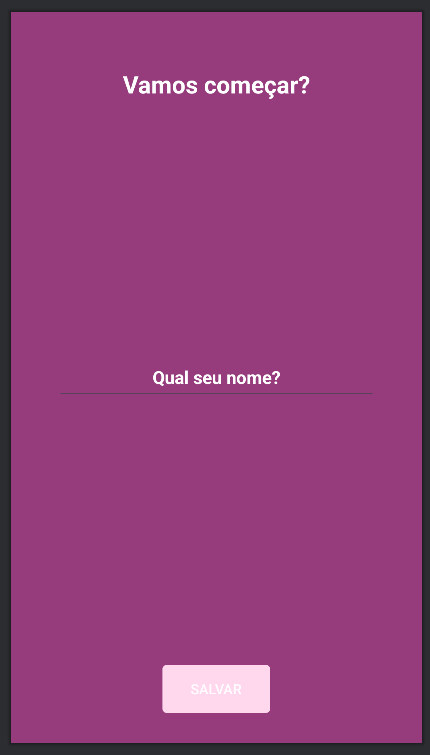
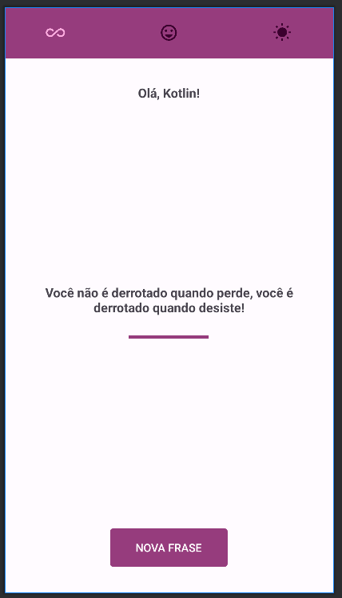
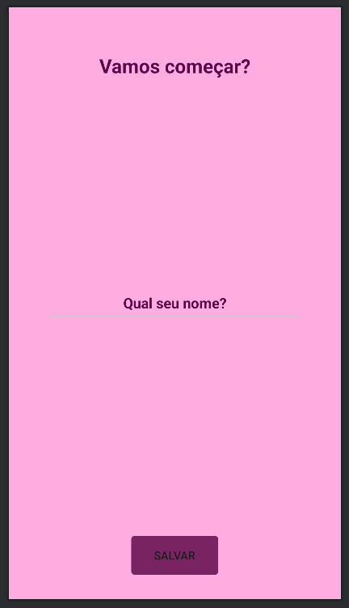

# Motivation

This repository was made as my solution to the exercise proposed in the 24th section of
the [App Development Using Kotlin - Desenvolvimento de Aplicativos Android Usando Kotlin in portuguese](https://www.udemy.com/course/curso-desenvolvedor-kotlin/)
course. The way I have approached the development of this app is simple: first I've tried to code
the app as close as possible to the result intended by the teacher. Then, I'll check the section to
see how the teacher tackled the development of this app. This is the second exercise from this
course that I have pushed to GitHub.

## Design Preview

### Light Theme

  

	<small><em>Main Activity - Light Theme</em></small>

 

  

	<small><em>User Activity - Light Theme</em></small>

### Dark Theme

  

	<small><em>Main Activity - Dark Theme</em></small>

 

  

	<small><em>User Activity - Dark Theme</em></small>

## Link to previous lesson from the course

[Section 20 - Travel Expense](https://github.com/helderzack/secao-20_gasto-viagem)